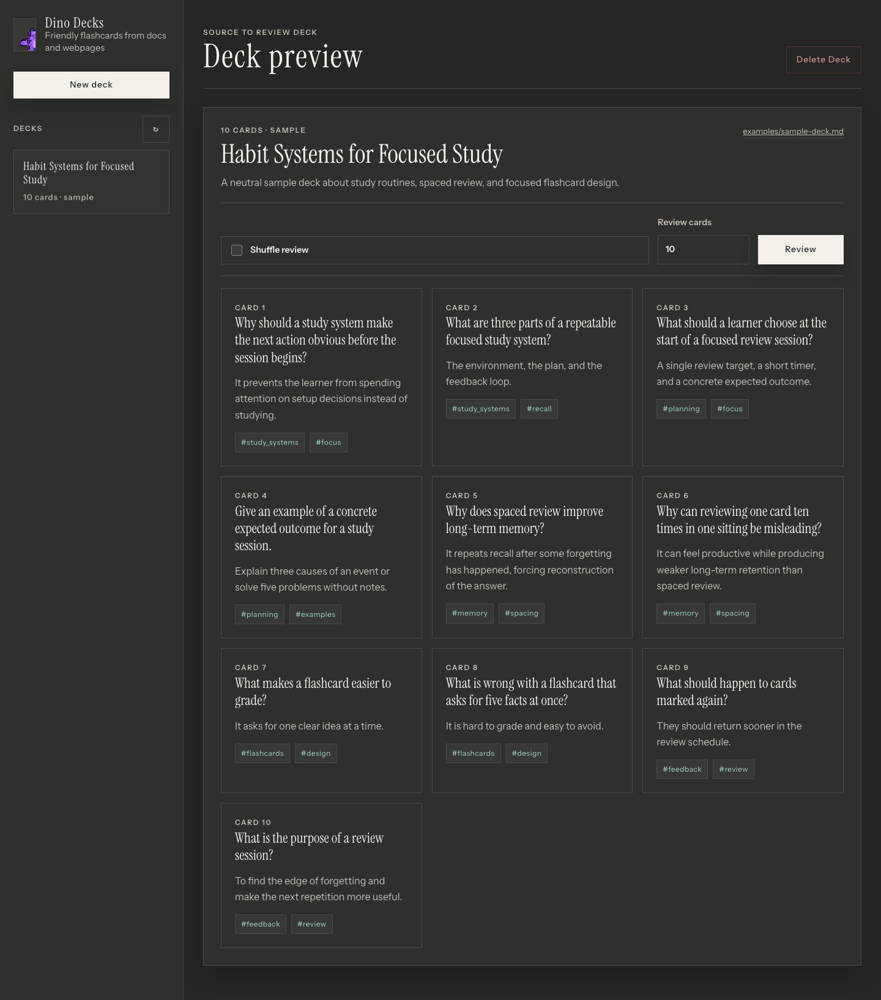
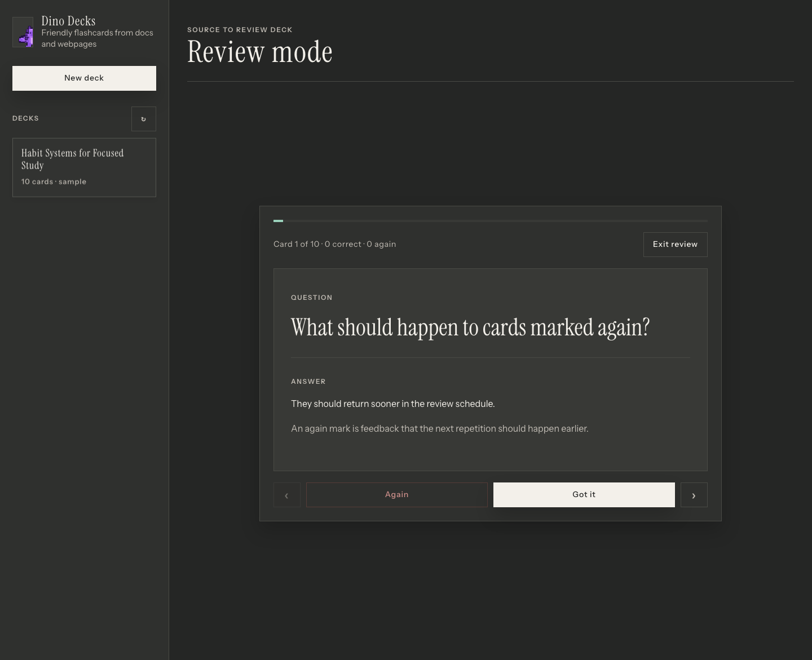

# Google-Doc-To-Flashcards

local app that uses LLMs (OpenAI, Gemini) to turn Google Docs or webpages into active-recall flashcards. It saves decks as Markdown and provides an interactive UI for reviewing cards



## Why this exists

This project is built for source-grounded review. It lets you take material you are already reading, use an LLM to generate focused recall questions, and save the output as a markdown flashcard deck you can revisit later.

It is designed for lightweight study across technical notes, data experiment concepts, chip design references, Japanese practice, trivia, or any other topic where repeated recall helps keep knowledge fresh.

The markdown-first format keeps decks easy to inspect, edit, archive, transfer, and reuse outside the app.

The project supports both local CLI workflows and API-based generation. Local usage is useful when you already have access to subscription-based coding or chat tools, while API usage gives you a more direct and automated path when needed.


## Quick Start

The app uses the Python standard library at runtime. Python 3.11 or newer is recommended.

```bash
python3 app.py
```

Open `http://127.0.0.1:8765`.

## Examples

Neutral sample material is available in `examples/`:

- `examples/sample-source.md`: source text for a demo deck.
- `examples/sample-deck.md`: markdown deck with the hidden JSON block used by the app.
- `examples/screenshots/`: deck preview and review-mode screenshots.

## Review on mobile (desktop stays the source of truth)

Decks live as markdown files on whichever machine runs `app.py`. To review those decks from a phone, keep the desktop as the server and connect over a trusted private network.

```bash
HOST=0.0.0.0 APP_PASSCODE=your-strong-passphrase python3 app.py
```

Then open the printed desktop URL from the phone. For remote access, prefer [Tailscale](https://tailscale.com) or another private-network tool over port forwarding.

The web UI includes PWA metadata and a service worker. Once a phone has synced, decks are cached for offline review; generating, deleting, or fetching new decks still requires the live Python backend.

When `APP_PASSCODE` is set, each device signs in once with a signed, HttpOnly cookie. Optional auth settings:

- `APP_AUTH_TTL_DAYS`: cookie lifetime, default `30`.
- `APP_AUTH_SECRET`: rotate to revoke every signed-in device.
- `APP_COOKIE_SECURE=1`: use when serving over HTTPS.

This passcode gate is intended for private-network use. Do not expose this server directly to the public internet without HTTPS and normal production hardening. To sign out a device, visit `/logout`.

## CLI

The CLI runs the same deck workflow without the local web API server.

Generation defaults to Codex CLI because it can be a lower-cost option than making separate API calls for this personal workflow. Use `--openai-api` when you prefer the direct OpenAI API path or need behavior tied to an API key and model setting.

Generate a deck:

```bash
python3 flashcards_cli.py generate --doc "https://docs.google.com/document/d/.../edit" --cards 12
python3 flashcards_cli.py generate --webpage "https://example.com/article" --cards 12
python3 flashcards_cli.py generate --file notes.md --no-llm --title "Review Notes"
python3 flashcards_cli.py generate --doc "https://docs.google.com/document/d/.../edit" --openai-api --cards 12
```

Review from the terminal, or export a saved deck to Google Slides Apps Script:

```bash
python3 flashcards_cli.py list
python3 flashcards_cli.py review review-notes
python3 flashcards_cli.py google-auth
python3 flashcards_cli.py export-slides review-notes --script-out review-notes-slides.gs
python3 flashcards_cli.py export-slides review-notes --codex-cli --script-out review-notes-slides.gs
python3 flashcards_cli.py export-slides review-notes --gemini-cli --script-out review-notes-slides.gs
python3 flashcards_cli.py delete review-notes --yes
```

## Configure

Copy `.env.example` values into your shell or `.env` workflow as needed.

- `CODEX_CLI_BIN` optionally points the default Codex CLI provider at a specific `codex` binary.
- `CODEX_CLI_TIMEOUT` optionally changes the Codex CLI generation timeout, default `180` seconds.
- `OPENAI_API_KEY` enables the optional OpenAI API generator.
- `OPENAI_MODEL` defaults to `gpt-4o-mini`.
- `GOOGLE_OAUTH_ACCESS_TOKEN` enables private Google Doc import and direct Google Slides export from the web UI.
- `GOOGLE_AUTH_PROVIDER=gcloud` uses Google Cloud CLI Application Default Credentials instead of a pasted token.
- `GOOGLE_AUTH_SCOPES` overrides the gcloud scopes used for private Docs and Slides export.
- `GCLOUD_BIN` optionally points at a specific `gcloud` binary.
- `GEMINI_CLI_BIN` optionally points the Gemini CLI export provider at a specific `gemini` binary.
- `GEMINI_CLI_TIMEOUT` optionally changes the Gemini CLI export timeout, default `180` seconds.

Source access notes:

- Public Google Docs shared with anyone who has the link can be imported without a Google token.
- Webpage import reads public `http://` or `https://` pages. For private, local, intranet, or sign-in-gated pages, save the text locally and use `--file`.
- Without an OpenAI key, the app creates a local fallback deck for testing.
- Google Slides export is available from the deck preview and the CLI. The web button creates a deck in the same dark Dino Decks style and returns a Google Slides URL. Either set `GOOGLE_OAUTH_ACCESS_TOKEN` with Slides and Drive scopes, or run `python3 flashcards_cli.py google-auth --run` once and start the app with `GOOGLE_AUTH_PROVIDER=gcloud python3 app.py`. The CLI can still emit Apps Script for manual workflows.
- `gcloud` may require an OAuth Desktop client JSON for Drive/Slides scopes. If the login command rejects the scopes, create the OAuth client in Google Cloud Console and rerun `python3 flashcards_cli.py google-auth --run --client-id-file path/to/client.json`.

## Development

Install test dependencies and run the suite:

```bash
python3 -m pip install -e ".[dev]"
python3 -m pytest -q
```

## Output

Decks are saved as markdown files in `decks/`. Each file includes a hidden JSON block for the app plus readable markdown cards.

## Screenshots

Review mode:


